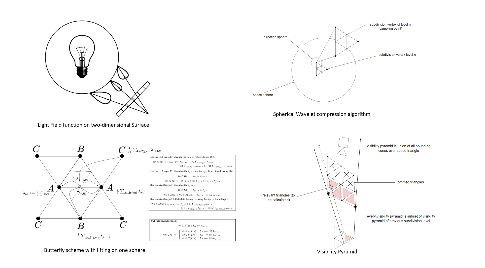

# Light Field defined on the suface

If the scattering in the medium could be ignored (“clear air”), plenoptic function is constant in any intervals contains no objects. Knowing light field function on virtual or real two-dimensional surface let us reconstruct the whole plenoptic optic function in any point of space which is not occluded by obstacles. 

            
Light Field Structure

Simple checker test (light field compared to the background)

Back Light 

Light Guide

# Future work
    Folding of dimension (analog to 2d square case)    
    Vertex dictionary and acceleration lookup 
    Compression        
            Ray Tracing 
            Patches/paging on HDD/SSD            
    Reconstruction              
        Sparse vs Dense Representation
        Dropping test        
        Border definition                 
        Camera movement (forecast)
        New vertex calculation
        Garbage Clean Up
        Dynamic level of details
        GPU implementation
            streaming
            cashing 

